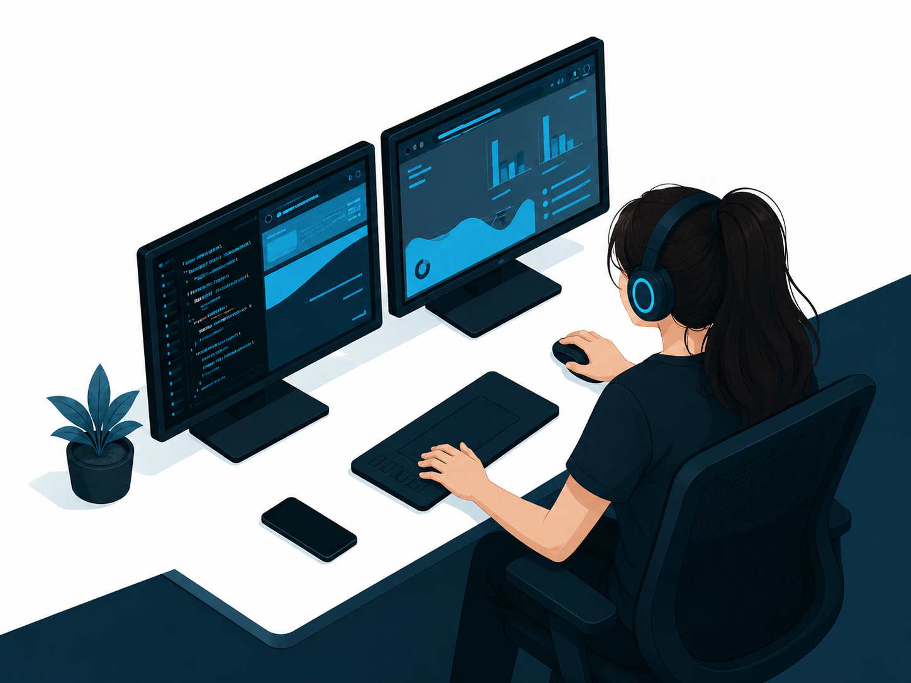

<h1 align="center">Hi 👋, I'm Nagma Shaikh</h1>

<h3 align="center">
💻 Full Stack Developer (Learning) | 🌐 Web Developer | 🚀 Tech Enthusiast
</h3>

---

# 👩‍💻 About Me

Hi! I'm **Nagma**, a passionate Computer Engineering student who enjoys learning new technologies and building practical applications.

- 🌱 Currently learning **Full Stack Development**
- 💻 Interested in **Web Development**
- 🚀 Building projects to improve my skills
- 📚 Exploring modern JavaScript and backend technologies
- 💡 Love solving problems and learning new concepts
- 🎯 Goal: Become a skilled Software Developer

 

---

# 🚀 Tech Stack

### 💻 Languages

### 🛠️ Tools & Technologies

### 🌐 Currently Learning

- Frontend Development
- Backend Development
- REST APIs
- Database Management
- Responsive UI Design

---

# 📂 Projects

🚀 **Projects are coming soon!**

Currently working on:

- 🌐 Full Stack Web Applications
- 💻 College Projects
- 🚍 Smart Transport Operations Platform
- 📱 JavaScript Applications

Stay tuned for more exciting repositories!

---

# 📊 GitHub Statistics

---

# 🎯 Goals

- 🚀 Become a Full Stack Developer
- 🌐 Build impactful web applications
- 💡 Learn modern frameworks and technologies
- 🤝 Contribute to Open Source
- 📚 Continuously improve programming skills

---

# 🌐 Connect With Me

<!-- ---

# 🏆 GitHub Trophies

--- -->

# ✨ Quote

> **"Success is built one line of code at a time."** 💻

---

<h3 align="center">

✨ Thanks for Visiting My Profile

</h3>
